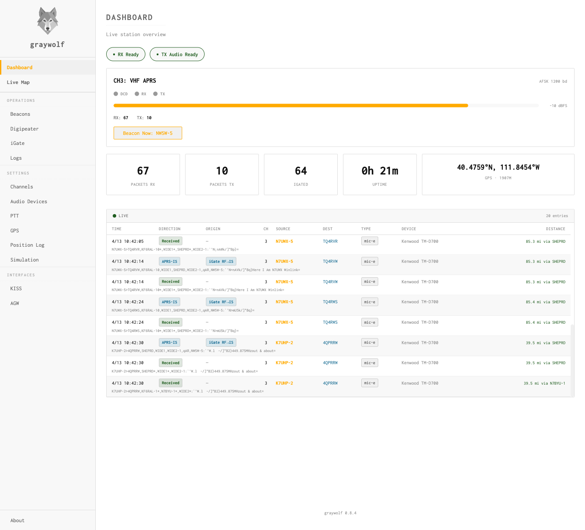

<p align="center">
  
</p>

Graywolf is a modern APRS station with a software modem, digipeater, iGate, and web UI. It bundles everything you need to put an APRS station on the air — from raw audio demodulation to APRS-IS gating — and makes it easy with a browser-based configuration interface. 

**📖 [Read the Handbook](https://chrissnell.com/software/graywolf/)** — installation, configuration, operation guide, and REST API reference.

**🔧 [Known-Working Configurations](https://chrissnell.com/software/graywolf/configurations.html)** — community-tested hardware setups with exact settings. Check here for your device, and submit a PR if yours isn't listed.

**💬 [Graywolf APRS Discord](https://discord.gg/TYcHzgWf)** — community chat for help, discussion, and development.

Written by Chris Snell, [NW5W](https://nw5w.com). 

The modem is written in Rust and includes a port of the AFSK demodulator from [Dire Wolf](https://github.com/wb2osz/direwolf) by WB2OSZ.

The AX.25 decoding, APRS operatations (beacons, digipeater, and iGate), and the web API is handled by a service written in the Go programming language.

The web frontend was built in Svelte.

## Performance
Graywolf achieves high decoding performance using inexpensive, off-the-shelf hardware. Its AFSK decoder can decode 1005 packets off [track 1 of the WA8LMF CD](http://www.wa8lmf.net/TNCtest/), identical in performance to Direwolf, from which Graywolf was ported.

```% ./bench.sh aprs-test-tracks/02_100-Mic-E-Bursts-DE-emphasized.flac 1
Building Direwolf (atest)...
Building Graywolf (demod_bench)...

=== Direwolf (atest) — 1 iterations ===
982 packets decoded in 45.614 seconds.  34.0 x realtime

=== Graywolf (demod_bench) — 1 iterations ===
982 packets decoded in 6.792s.  228.2 x realtime
```

## Features

<p align="center">
  
</p>

- **Modern Web UI** - Configure and monitor your station from your browser, with live packet logs and preset-driven setup for digipeater and iGate

  - Imperial/Metric unit toggle for altitude, distance, and speed

- **Live Map** - Real-time APRS station map with trails, weather overlays, APRS-IS layer, and station popups with path and heard-via details

- **Software Modem** - Native Rust DSP, no external sound card tooling required

  - AFSK 1200 baud (Bell 202)
  - 9600 baud G3RUH
  - PSK
  - FX.25 and IL2P forward error correction
  - SDR input support

- **Push-to-Talk** - Multiple PTT methods for any setup

  - Serial RTS/DTR (Digirig, USB-serial adapters)
  - CM108 USB HID GPIO (AIOC, homebrew sound card adapters)
  - Linux GPIO (Raspberry Pi, BeagleBone)
  - Hamlib rigctld (CAT control)

- **Digipeater** - Full-featured APRS digipeater

  - WIDEn-N path handling
  - Preset-driven configuration (fill-in, wide-area, etc.)
  - Duplicate suppression
  - Per-path filtering

- **iGate** - Bidirectional APRS-IS gateway

  - RF → APRS-IS and APRS-IS → RF gating
  - Configurable filters
  - Packet origin tracking in logs

- **TNC Interfaces** - Speak the protocols other packet software expects

  - KISS TNC (serial and TCP)
  - AGWPE TCP interface

- **Beacons and GPS** - Position reporting made easy

  - Static and GPS-driven position beacons
  - Status and telemetry beacons
  - Configurable beacon intervals and paths

- **Observability**

  - [Prometheus](https://prometheus.io/) metrics
  - Packet logging to SQLite
  - Live packet stream in the web UI

- **Simple installation** - single binary, SQLite config database

  - systemd service unit
  - Debian/Ubuntu (APT), Red Hat (RPM), and Arch (AUR) packages
  - Windows installer (MSI)
  - Runs on x86-64 and ARM (Raspberry Pi)
